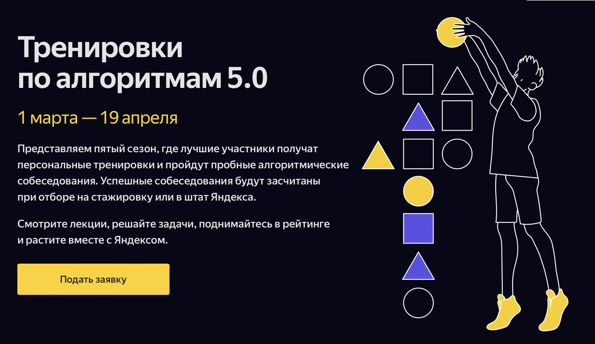

 
    

 

### Тренировки по алгоритмам 5.0
* Лекция 1: Сложность, тестирование, особые случаи
* Лекция 2: Линейный поиск
* Лекция 3: Множества и словари
* Лекция 4: Бинарный поиск

### Instructors
[Михаил Густокашин]

Директор центра студенческих олимпиад ФКН ВШЭ, преподаватель алгоритмов и структур данных на ФКН ВШЭ, тренер медалистов ICPC, автор онлайн-курсов (Основы программирования на Python — Coursera, Введение в программирование (C++) — Stepik и др.), заведующий кафедры информатики в ЦПМ, руководитель смен в Сириусе.

